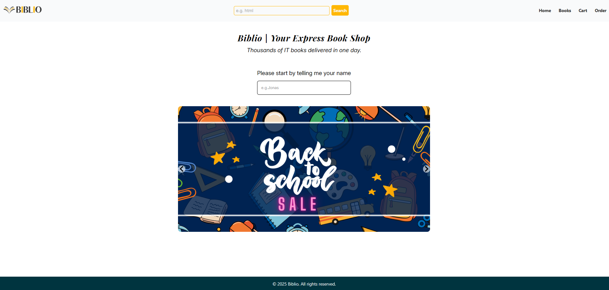

# Biblio

> A modern and minimalist Book Shop web application built with **React**, **TypeScript**, **Tailwind CSS**, **Redux**, **React Router** , and **Firebase**.

## Table of contents

- [Biblio](#biblio)

  - [Table of contents](#table-of-contents)
  - [General info](#general-info)
  - [Screenshots](#screenshots)
  - [Tech Stack](#tech-stack)
  - [Code Examples](#code-examples)
  - [Features](#features)
  - [To-do list](#to-do-list)
  - [Status](#status)
  - [Goals](#goals)
  - [Contact](#contact)

  ## General info

**Biblio** is a simple and user-friendly online book store application.  
Users can browse books, add them to a cart, and place orders.  
The app fetches data from the [IT Book Store API](https://api.itbook.store/1.0/search/) and uses **Firebase** for backend services such as order storage.  
Version 1 of the project is now complete and was built to practice working with Redux, React Router, and Firebase integration.

## Screenshots




## Tech Stack

- **React**
- **TypeScript**
- **Tailwind CSS**
- **Redux**
- **React Router**
- **Firebase**
- **Visual Studio Code**
- [IT Book Store API](https://api.itbook.store/1.0/search/)

## Code Examples

```ts
function getPosition() {
  return new Promise<GeolocationPosition>(function (resolve, reject) {
    navigator.geolocation.getCurrentPosition(resolve, reject);
  });
}

export const fetchAddress = createAsyncThunk(
  'user/fetchAddres',
  async function () {
    const positionObj = await getPosition();
    const position = {
      latitude: positionObj.coords.latitude,
      longitude: positionObj.coords.longitude
    };
    const addressObj = await fetchGeoLocation(
      position.latitude,
      position.longitude
    );

    const address = `${addressObj?.locality},  ${addressObj?.city} ${addressObj?.postcode}, ${addressObj?.countryName} `;
    return { position, address };
  }
);
```

## Features

- Input user name
- Search and browse books from IT Book Store API
- Add books to a shopping cart
- View and manage cart items
- Place an order
- Firebase integration for backend support

## To-do list

- product page
- user authentication
- Complete checkout flow with form validation

## Status

Project is: ✅ Version 1 completed

## Goals

- Build a clean and functional front-end book ordering experience
- Practice component-based architecture using React
- Practice Redux state management in a real-world scenario
- Strengthen understanding of TypeScript and routing with React Router

## Contact

By [boba-milktea](https://github.com/boba-milktea)
